## What is machine learning?
Allows machine to `learn` and make `decisions smartly`
In ML Machines learn from `data` provided
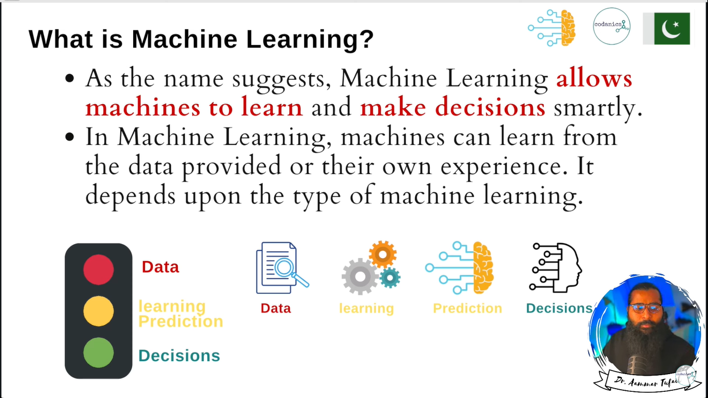
## Types of Machine learning
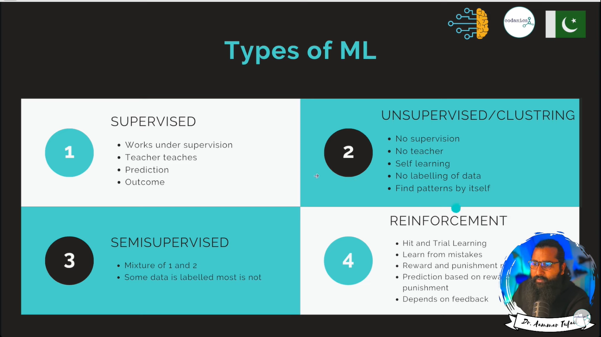
## Supervised learnig
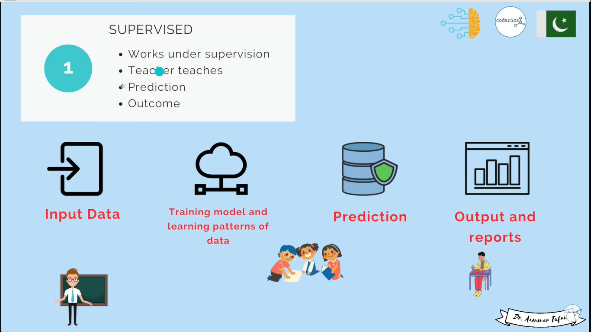
## Types of Supervised ML Algos
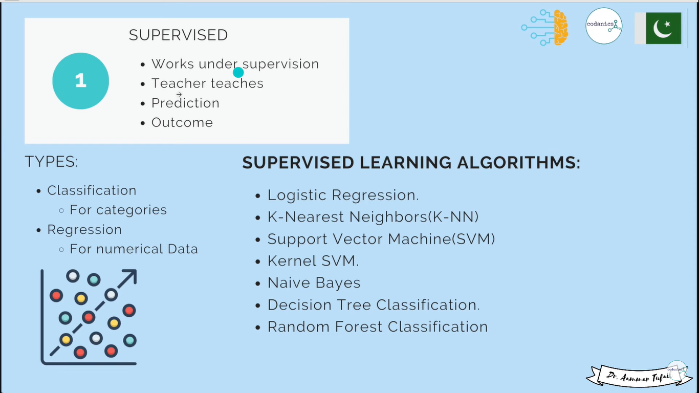
## Unsupervised ML
A type of Machine Learning that doesn't require labled data
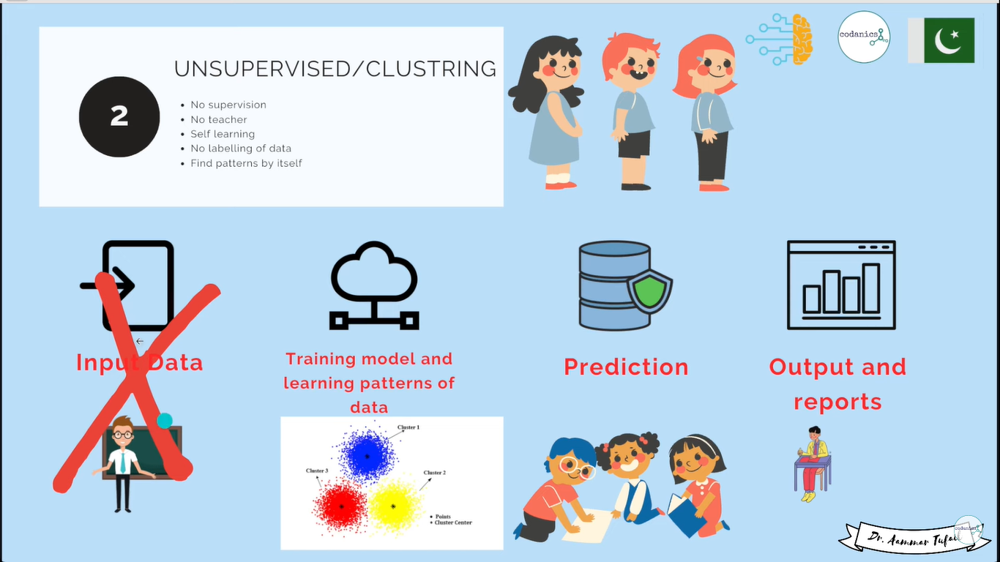
## Types of UnSupervised ML Algos
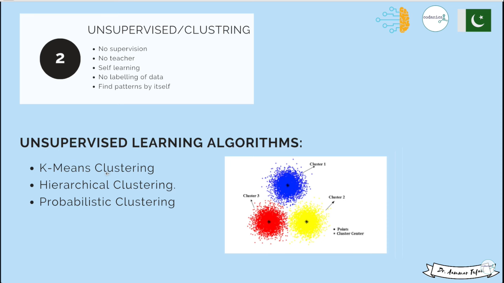
## Semi-supervised ML 
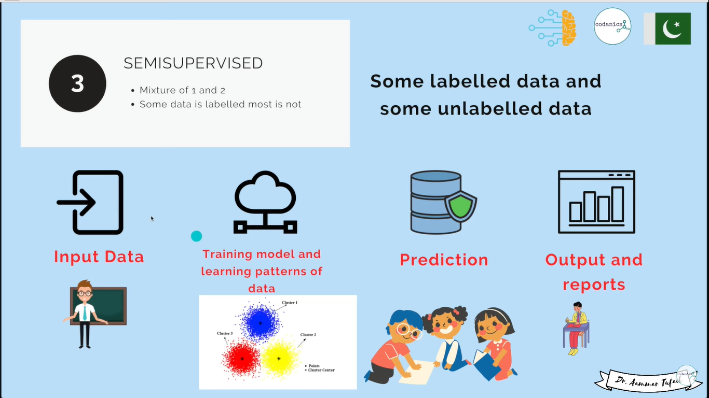
## Reinforcement Learning
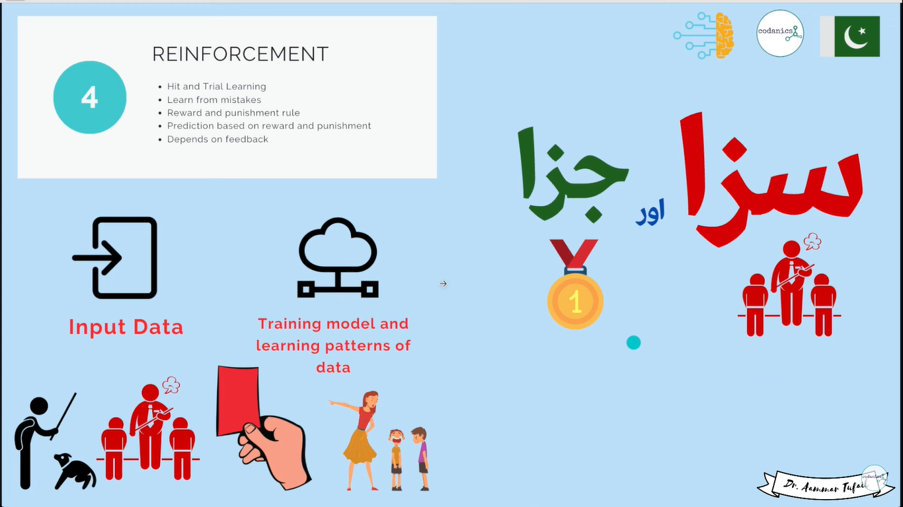
## Reinforcement Learning Types
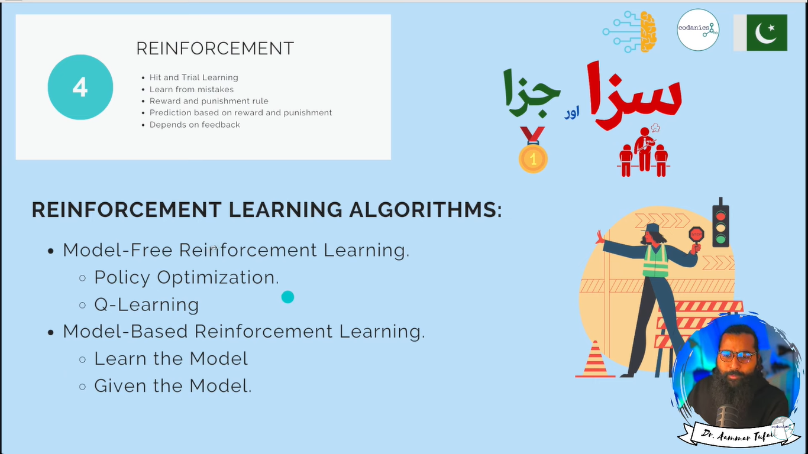
# AS A whole ML has 4-types
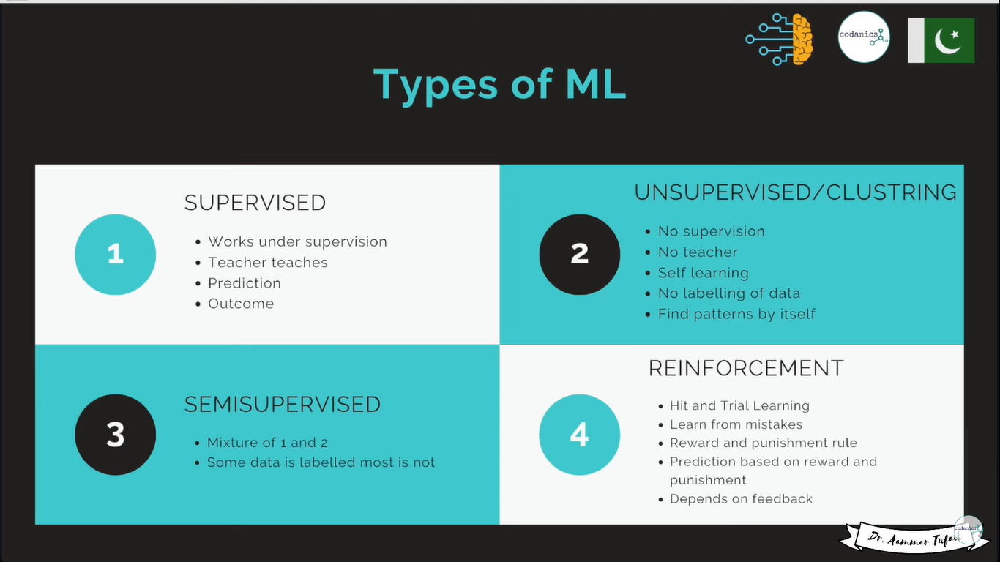
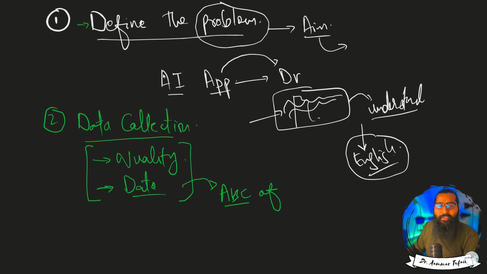
# steps for ML
- 1. Define the problem
- 2. Data collection -> Gathering Data 
- 3. Data Pre-Processing -> Cleaning the data/ wrangling 80% of time in data processing
- 4. Choose a Model
  - `Classification` Algos -> Categorical
  - `Regression` Algos => Numerical
  - Both the types have separate Algorithms
- 5. Spliting the Data
  - `X` in independent can be one or more varible based on we predict `y`
    - Its also called `Predictors`, `input`, `features`
  - `y` is dependent is also known as `Output`, `label`

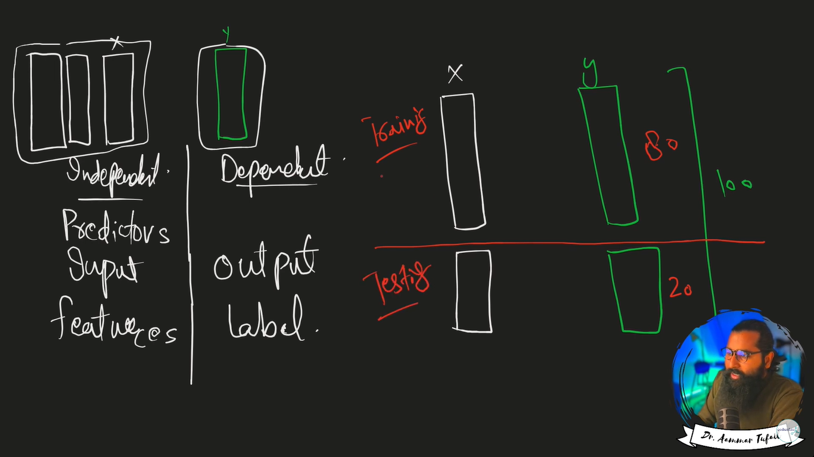
- 6. `Evaluating` the model Metrics
   - `Metrics` used for the model evaluation like `R-square` , `RMSE` and `MSE`
- 7. `Hyper-Parameter` Tunning if model not working well will increase the performance of the model this requres model in `depth knowlege` and `theoratical` understanding
- 8. `Cross Validation` train same model on different `subset` of the data which will `increase` model accuracy
  - Removing the biasness from the data
    - There are several types of cross-validation methods, each with its own advantages and use cases. Here are some common types:

    - `K-Fold Cross-Validation:` In K-fold cross-validation, the dataset is divided into K equal-sized folds. The model is trained K times, each time using K-1 folds as training data and the remaining fold as the validation data. The performance of the model is then averaged over the K iterations.
    - `Stratified K-Fold Cross-Validation:` Stratified K-fold cross-validation is similar to K-fold cross-validation, but it ensures that each fold has approximately the same proportion of samples from each class. This is useful for classification problems with imbalanced class distributions.
    - `Leave-One-Out Cross-Validation (LOOCV):` In leave-one-out cross-validation, a single observation is used as the validation data, and the model is trained on the remaining N-1 observations. This process is repeated N times, with each observation being used once as the validation data. LOOCV is computationally expensive but provides a less biased estimate of model performance, especially for small datasets.
- 9. `Model Finalization` by multi data validation
- 10. `Deploy Model` like on App, webapp, software -> MLOps
- 11. `Retest`, `Update`, control the `versioning`, and `Monitor`

## Algorithm
Set of `instructions` given to an `AI system` to help it learn from data
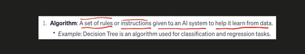
## Training and testing Data
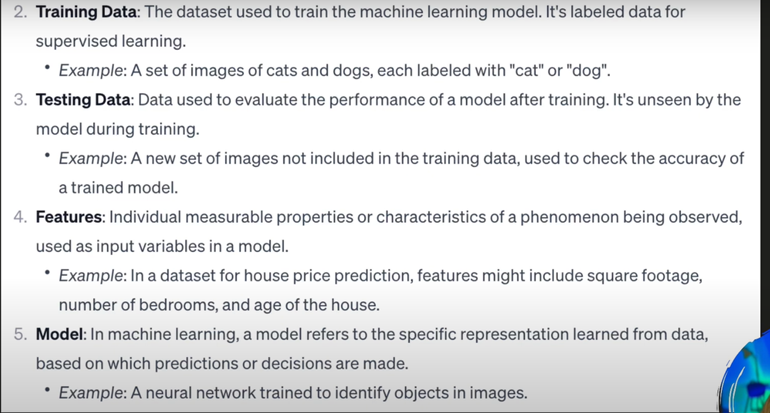