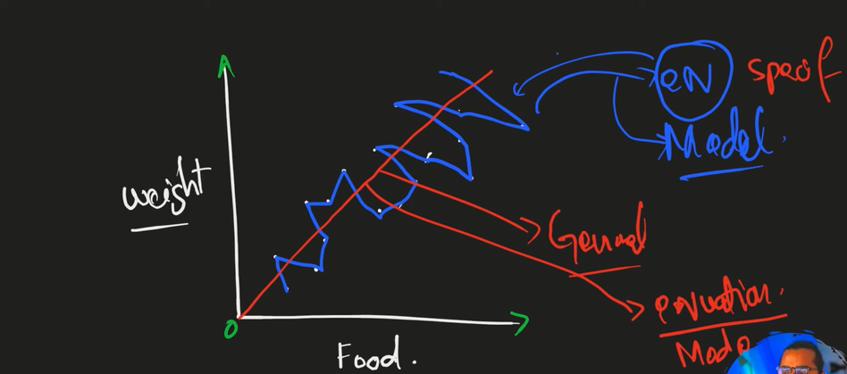
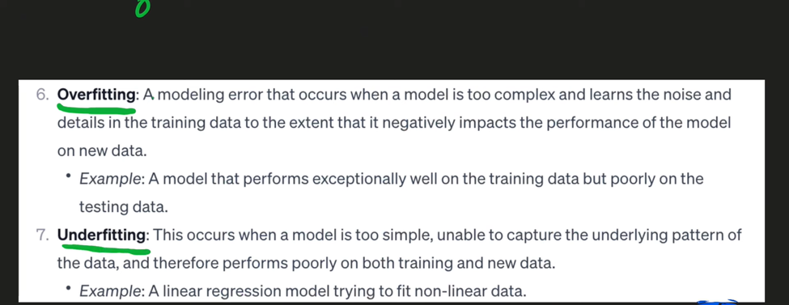
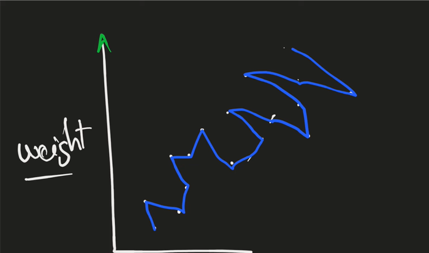
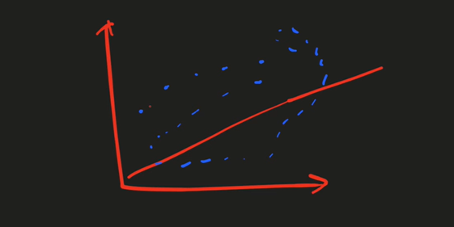

## `Over fitting and Under fitting`

 
 

- Always use `generalized model` in `red` to work on the unknown data the the `specific model` in `blue`
 

### Overfitting:
- Model performs well on training data but poorly on test/unseen data
  - High bias, low variance

### Overfitting:
A model error that occurs when the model is too complex and learns the noise and details in the training data rather than the underlying pattern
- More `parameters` => more chances of overfitting than underfitting
  - `Regularization` techniques can help in reducing overfitting by adding a penalty term to `loss function or using dropout`
  - `Regularization` techniques (Ridge, Lasso, ElasticNet) can help in reducing the number of parameters which helps in avoiding
